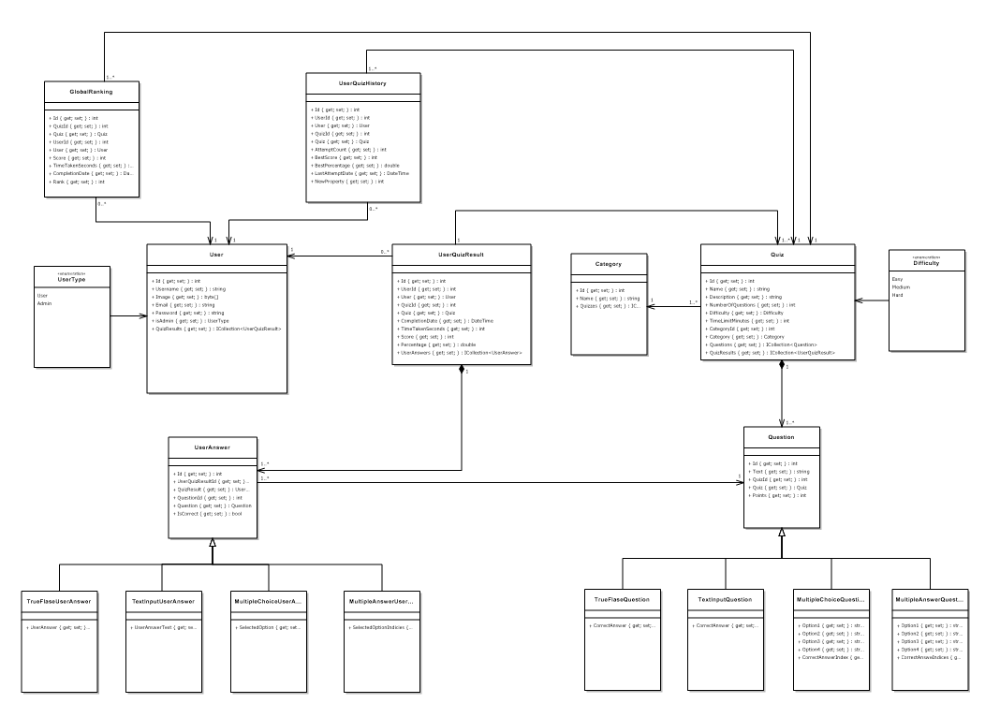

# Quiz Hub 

A comprehensive full-stack quiz application built with ASP.NET Core and React, featuring multiple question types, real-time scoring, and global leaderboards.

## 📋 About

Quiz Hub is an interactive quiz platform that allows users to take timed quizzes across various categories and difficulty levels. The application supports multiple question types including multiple choice, multiple answer, true/false, and text input questions. Users can track their progress, view detailed results, and compete on global leaderboards.
The application also supports real-time multiplayer competitions where multiple users can compete simultaneously in a quiz room with live rankings and speed-based scoring.

### Key Features

**For Users:**
- 🔐 User registration and authentication with JWT tokens
- 📚 Browse and filter quizzes by category, difficulty, and keywords
- ⏱️ Take timed quizzes with automatic submission
- 📊 View detailed results with correct answer comparisons
- 📈 Track personal quiz history and progress
- 🏆 Compete on global leaderboards
- 🚀 Join live competition room for real-time multiplayer quizzes

**For Admins:**
- ✏️ Full CRUD operations on quizzes and questions
- 🏷️ Quiz categorization and management
- ⚖️ Create weighted scoring systems
- 📋 View user results and analytics
- 🎪 Create and manage a live competition room

**Question Types Supported:**
- **Multiple Choice**: Classic 4-option questions with one correct answer
- **Multiple Answer**: Questions requiring selection of all correct options
- **True/False**: Simple binary questions
- **Text Input**: Fill-in-the-blank questions with exact text matching

## 🏗️ Architecture



### Tech Stack

**Backend:**
- ASP.NET Core 8.0
- Entity Framework Core
- JWT Authentication
- SQL Server
- BCrypt Password Hashing
- WebSocket support for live competitions

**Frontend:**
- React 19.1.0
- React Router
- React Hot Toast 
- Lucide React 
- Recharts 
- Tailwind CSS 

## 🚀 Getting Started

### Prerequisites

- [.NET 8.0 SDK](https://dotnet.microsoft.com/download/dotnet/8.0)
- [Node.js 18+](https://nodejs.org/)
- [npm](https://www.npmjs.com/) or [yarn](https://yarnpkg.com/)

### Windows Setup

#### 1. Clone the Repository
```bash
git clone https://github.com/yourusername/quiz-hub.git
cd quiz-hub
```

#### 2. Backend Setup (Windows)

1. **Navigate to the backend directory:**
   ```bash
   cd quiz-hub-backend
   ```

2. **Install dependencies:**
   ```bash
   dotnet restore
   ```

3. **Configure Database Connection:**
   
   Update `appsettings.json` with your SQL Server connection string:
   ```json
   {
     "ConnectionStrings": {
       "DefaultConnection": "Server=YOUR_SERVER_NAME;Database=QuizHubDB;Trusted_Connection=True;TrustServerCertificate=True;"
     },
     "JWT_SECRET_KEY": "your-super-secret-jwt-key-at-least-32-characters-long",
     "JWT_ISSUER": "QuizHubApp",
     "JWT_AUDIENCE": "QuizHubUsers"
   }
   ```

4. **Create and Apply Database Migrations:**
   
   Open Package Manager Console in Visual Studio or use the .NET CLI:
   ```bash
   # Create initial migration
   dotnet ef migrations add InitialCreate
   
   # Apply migration to database
   dotnet ef database update
   ```

5. **Run the Backend:**
   ```bash
   dotnet run
   ```
   The API will be available at `https://localhost:7000`

#### 3. Frontend Setup (Windows)

1. **Navigate to the frontend directory:**
   ```bash
   cd ../quiz-hub-frontend
   ```

2. **Install dependencies:**
   ```bash
   npm install
   ```

3. **Configure Environment Variables:**
   
   Create a `.env` file in the frontend root:
   ```env
   REACT_APP_API_BASE_URL=https://localhost:7000/api
   ```

4. **Start the Development Server:**
   ```bash
   npm start
   ```
   The application will be available at `http://localhost:3000`

### macOS Setup

#### 1. Clone the Repository
```bash
git clone https://github.com/yourusername/quiz-hub.git
cd quiz-hub
```

#### 2. Backend Setup (macOS with Docker)

1. **Start SQL Server with Docker:**
   ```bash
   docker run -e "ACCEPT_EULA=Y" -e "SA_PASSWORD=YourStrong@Passw0rd" \
              -p 1433:1433 --name sqlserver \
              -d mcr.microsoft.com/mssql/server:2022-latest
   ```

2. **Navigate to the backend directory:**
   ```bash
   cd quiz-hub-backend
   ```

3. **Install dependencies:**
   ```bash
   dotnet restore
   ```

4. **Configure Database Connection:**
   
   Update `appsettings.json` for Docker SQL Server:
   ```json
   {
     "ConnectionStrings": {
       "DefaultConnection": "Server=localhost,1433;Database=QuizHubDB;User Id=sa;Password=YourStrong@Passw0rd;TrustServerCertificate=True;"
     },
     "JWT_SECRET_KEY": "your-super-secret-jwt-key-at-least-32-characters-long",
     "JWT_ISSUER": "QuizHubApp",
     "JWT_AUDIENCE": "QuizHubUsers"
   }
   ```

5. **Install Entity Framework Tools:**
   ```bash
   dotnet tool install --global dotnet-ef
   ```

6. **Create and Apply Database Migrations:**
   ```bash
   # Create initial migration
   dotnet ef migrations add InitialCreate
   
   # Apply migration to database
   dotnet ef database update
   ```

7. **Run the Backend:**
   ```bash
   dotnet run
   ```
   The API will be available at `https://localhost:7000`

#### 3. Frontend Setup (macOS)

1. **Navigate to the frontend directory:**
   ```bash
   cd ../quiz-hub-frontend
   ```

2. **Install dependencies:**
   ```bash
   npm install
   ```

3. **Configure Environment Variables:**
   
   Create a `.env` file in the frontend root:
   ```env
   REACT_APP_API_BASE_URL=https://localhost:7000/api
   ```

4. **Start the Development Server:**
   ```bash
   npm start
   ```
   The application will be available at `http://localhost:3000`

## 🌟 Usage

1. **Register a new account** or log in with existing credentials
2. **Browse available quizzes** using filters and search
3. **Take a quiz** - answer questions within the time limit
4. **View your results** with detailed feedback
5. **Track your progress** in the personal results section
6. **Compete** on global leaderboards